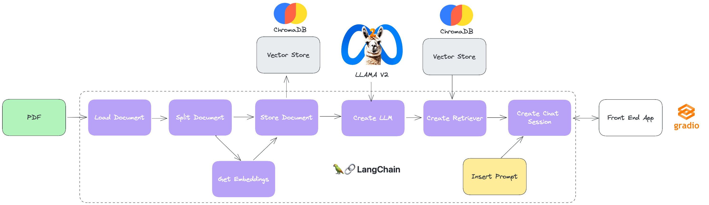

# ChatPDF com LLAMA V2 (Meta)

[![Contributors][contributors-shield]][contributors-url]
[![Forks][forks-shield]][forks-url]
[![Stargazers][stars-shield]][stars-url]
[![LinkedIn][linkedin-shield]][linkedin-url]


## Sobre
Este projeto foi criado com o objetivo de ensinar a construção de uma ferramenta similar ao ChatPDF (que é um ChatGPT que "conversa com PDFs") utilizando como LLM (Large Language Model) o modelo open-source LLAMA V2 (Meta), rodando localmente.

Com base na primeira versão deste projeto, participei de uma Live no Canal da Rocketseat no Youtube no dia 10/08/2023, onde expliquei os principais conceitos desta aplicação, o código e rodei alguns exemplos. Caso queira conferir a gravação desta Live, acesse este [link](https://www.youtube.com/live/xtbYqof3ErY?si=49n71Pwk5YkOsLjH).

## Diagrama da Solução
Para facilitar o entendimento dos "building blocks" desta solução, segue um diagrama abaixo que apresenta a sequência de ações e componentes do projeto.



## Tecnologias utilizadas

- [Langchain](langchain.com): É um framework de código aberto que fornece uma API simples e flexível para trabalhar com LLMs. Ele permite que os desenvolvedores criem aplicações que usem LLMs para uma variedade de tarefas, incluindo tradução, geração de texto, resposta a perguntas (Q&A), agentes, dentre outras. Seu ecossistema de conectores inclui integração com os mais diversos LLMs, Vector Databases, Chat Engines, o que o torna uma opção poderosa e versátil para construção de aplicações com LLMs.

- [ChromaDB](www.trychroma.com): É um Vector Database utilizado para armazenamento de embeddings, que são vetores que representam o significado de palavras ou frases. Ele permite que os desenvolvedores armazenem e pesquisem embeddings de forma eficiente, o que é essencial para aplicações que usam LLMs. O ChromaDB usa um algoritmo de busca por nearest neighbors para encontrar embeddings que são semelhantes a um determinado embedding. Isso permite que os desenvolvedores pesquisem grandes conjuntos de dados de embeddings de forma rápida e precisa.

- [Gradio](www.gradio.app): É uma biblioteca Python que permite criar rapidamente interfaces gráficas para prototipagem e testes de modelos de machine learning. Com o Gradio, é possível transformar funções Python em interfaces interativas com apenas algumas linhas de código. Ele é particularmente útil para demonstrar ou testar modelos de aprendizado de máquina sem a necessidade de construir uma aplicação completa.

- [LLAMA V2](ai.meta.com/llama/): É uma coleção de LLMs open-source pré-treinados e fine-tuned, que variam de 7 bilhões a 70 bilhões de parâmetros. Os LLMs fine-tuned, chamados Llama 2-Chat, são otimizados para casos de uso de diálogo, como chats e interfaces conversacionais. Os modelos LLAMA V2 superam os modelos de chat de código aberto na maioria dos benchmarks em que foram testados, e com base em nossas avaliações humanas de utilidade e segurança, podem ser um substituto adequado para modelos de código fechado.

## Requisitos

#### Instalar as bibliotecas necessárias (usando pip)

```bash
pip install -r requirements.txt
```

#### Instalar as bibliotecas necessárias (usando pipenv)

```bash
pipenv install
```

#### Baixar o modelo LLAMA V2
- Entre neste [link](https://ai.meta.com/resources/models-and-libraries/llama-downloads/) no site da Meta e preencha o formulário solicitando acesso ao LLAMA 2. Em geral está levando pouco tempo para que eles retornem um e-mail com o acesso.
- Após retorno da Meta no e-mail que você indicou no formulário, minha sugestão é fazer o download pelo site do Hugging Face. Pra isso, caso ainda não tenha, crie uma conta no Hugging Face através deste [link](https://huggingface.co/join), usando o mesmo e-mail indicado no formulário da Meta.
- Faça o login no Hugging Face e acesse este [link](https://huggingface.co/meta-llama/Llama-2-7b-chat-hf) que leva a página do modelo LLAMA 2 Chat dentro do HF e aceite os termos.
- Assim que o Hugging Face aprovar seu acesso, clique no botão  e escolha a opção Clone Repository. Siga as instruções na tela para clonar o modelo para a pasta de sua preferência.

## Configurações

Dentro da pasta config, existe um arquivo chamado .env, onde iremos configurar algumas informações para execução do nosso projeto.

- MODEL_PATH: Caminho completo do arquivo referente ao modelo LLAMA 2 que você irá utilizar.
- VECTORDB_FOLDER: Pasta onde o Chroma irá armazenar os embeddings dos documentos.
- DOCUMENTS_FOLDER: Pasta onde estão os PDFs que você irá carregar no seu projeto.
- SENTENCE_EMBEDDINGS_MODEL: Modelo que será usado para gerar os embeddings do seu documento.

Pra facilitar, eu deixei um arquivo .env preenchido com uma configuração padrão que considera que as pastas estão todas dentro da pasta deste projeto.

## Como executar o projeto

Basta abrir o Jupyter Notebook rag_pdf_live.ipynb em sua IDE de preferência e ir rodando as células em sequência.

Na célula final deste notebook, onde o Gradio instancia uma UI para interagirmos com a sessão de chat, aparece uma mensagem "Running on local URL:  http://127.0.0.1:XXXX" onde XXXX é a porta que o Gradio usou para subir a Web App. Pra facilitar a interação com o chat, basta clicar no endereço e seu browser padrão irá abrir com a janela de chat.

<!-- MARKDOWN LINKS & IMAGES -->
<!-- https://www.markdownguide.org/basic-syntax/#reference-style-links -->
[contributors-shield]: https://img.shields.io/github/contributors/fulviomascara/llamav2_local
[contributors-url]: https://github.com/fulviomascara/llamav2_local/graphs/contributors
[forks-shield]: https://img.shields.io/github/forks/fulviomascara/llamav2_local
[forks-url]: https://github.com/fulviomascara/llamav2_local/network/members
[stars-shield]: https://img.shields.io/github/stars/fulviomascara/llamav2_local
[stars-url]: https://github.com/fulviomascara/llamav2_local/stargazers
[linkedin-shield]: https://img.shields.io/badge/-LinkedIn-black.svg?logo=linkedin&colorB=555
[linkedin-url]: https://linkedin.com/in/fulviomascara